<div align="center">
  
</div>

<div align="center">
  
</div>

---

<table align="center" width="100%">
<tr>
<td width="60%" valign="top">

### What we are

**Essential Devs** is the infrastructure and applied research division of **[Quiten](https://quiten.tech)**. We prototype the foundational contracts, runtime primitives, and agentic orchestration layers that Quiten's production systems are built on — before those production systems exist.

We don't work on features. We work on the architecture that makes features safe to build.

</td>
<td width="40%" valign="top">

### Division status

```
org        : Essential Devs
parent     : Quiten
repos      : 23  (private)
engineers  : 14  active
clearance  : internal
visibility : restricted
```

</td>
</tr>
</table>

---

### Research Tracks

<table width="100%">
<tr>
<td width="33%" valign="top">

**`[01]` Agentic Orchestration**

Task graph design, Durable Object state contracts, failure recovery protocols, and HITL checkpoint specification for Quiten's autonomous operation layer.

</td>
<td width="33%" valign="top">

**`[02]` Zero-Trust Auth**

Credential isolation architecture. Quiten agents never hold raw user secrets. We own the policy model, audit trail design, and managed OAuth (RFC 9728) integration.

</td>
<td width="33%" valign="top">

**`[03]` Edge Infrastructure**

Low-level primitives for Cloudflare Workers, D1, R2, and Browser Run. Internal tooling that abstracts deployment complexity without giving up observability.

</td>
</tr>
</table>

---

### Stack

<div align="center">
  
</div>

<br/>

<div align="center">


</div>

---

### Division

<div align="center">

| | |
|:---:|:---|
| **Director** | [@fy2ne](https://github.com/fy2ne) |
| **Headcount** | 14 engineers — infrastructure, systems, research |
| **Repositories** | all active projects are private pending architecture review |
| **Releases** | infrequent by design — we ship when the architecture earns it |

</div>

---

### // System notice

<div align="center">

```
╔══════════════════════════════════════════════════════════════════╗
║                    [ PLATFORM MAINTENANCE ]                      ║
║                                                                  ║
║   quiten.tech is currently offline for a major infrastructure    ║
║   overhaul. Essential Devs operations continue internally.       ║
║   the upgraded platform ships on  08 / 08 / 2026 .               ║
╚══════════════════════════════════════════════════════════════════╝
```

**Time until Quiten Research Labs V2 launches ↓**
<br/>


</div>

---

<div align="center">
  <a href="https://quiten.tech">
    
  </a>
</div>

<br/>

<div align="center">
  
</div>
